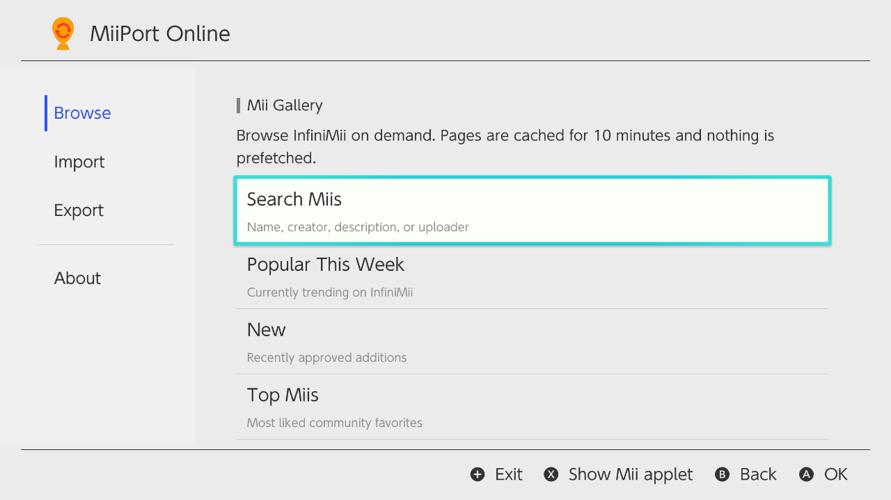
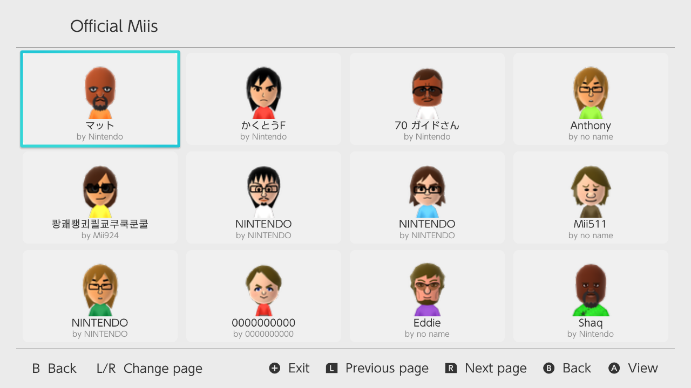
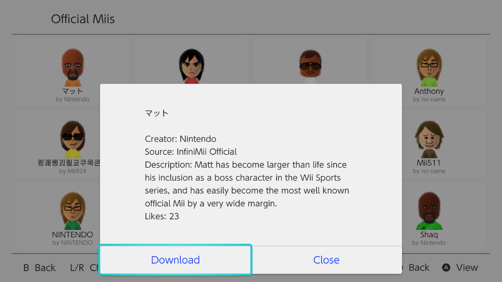

# MiiPort Online

<div align="center">
  <em>Find, view, and download Miis without leaving your Switch.</em>
</div>

MiiPort Online adds an InfiniMii browser to [MiiPort](https://github.com/Genwald/MiiPort). Search for a Mii or browse the available lists, then save it to your local Mii database. You don't need to download a file on another device or move it to your console by hand.

The original local import and export tools are still included.

## What it does

- Search by Mii name, creator, description, or uploader.
- Browse Popular This Week, New, Top Miis, Official Miis, and Random Miis.
- View results in a 4×3 image grid.
- Use the D-pad or control stick to move through the grid.
- Change pages with L and R.
- Open a Mii to view its details and download it.

## Screenshots

<table>
  <tr>
    <td width="50%"></td>
    <td width="50%"></td>
  </tr>
  <tr>
    <td align="center"><sub>Browse categories and search</sub></td>
    <td align="center"><sub>Popular Miis in the image grid</sub></td>
  </tr>
  <tr>
    <td width="50%"></td>
    <td width="50%"></td>
  </tr>
  <tr>
    <td align="center"><sub>Official Miis</sub></td>
    <td align="center"><sub>Mii details and download</sub></td>
  </tr>
</table>

## Install

1. Download [MiiPort Online 0.1.3-Online](https://github.com/KakarottoCake/MiiPort-Online/releases/tag/v0.1.3-Online).
2. Copy `MiiPort.nro` to `sd:/switch/`.
3. Start it from the Homebrew Menu.

Downloaded Miis are saved in `sd:/MiiPort/miis/Downloads/` and imported into the Mii database.

Some Mii database features may need this setting in `sd:/atmosphere/config/system_settings.ini`:

```ini
[mii]
is_db_test_mode_enabled=u8!0x1
```

## Build from source

Install devkitPro with libnx, libcurl, and the Switch build tools. Then clone the project with its submodules:

```sh
git clone --branch v0.1.3-Online --recurse-submodules https://github.com/KakarottoCake/MiiPort-Online.git
cd MiiPort-Online
./scripts/build-local -j2
```

The build writes `MiiPort.nro` to the project folder. Copy it to `sd:/switch/` to test it on a Switch or in Eden.

To include the optional QR import support, run:

```sh
./scripts/build-local ENABLE_QR=1 -j2
```

## macOS test harness

The macOS harness tests the catalog parser and network client without building a Switch app.

```sh
./scripts/build-macos-test
./build-macos/MiiPortMacTest
```

The first command builds the harness. The second runs the offline fixture test. Add `--live` to make one bounded request to InfiniMii.

## Performance

- Only the current page is requested.
- Catalog pages are cached for 10 minutes.
- Preview images load one at a time and are cached on the SD card.
- Only the current page's 12 preview images stay in GPU memory.
- Catalog, preview, and download requests run one at a time.

## License

The main project uses the ISC License. See [LICENSE.md](LICENSE.md). The Borealis submodule has its own GPLv3 license.
